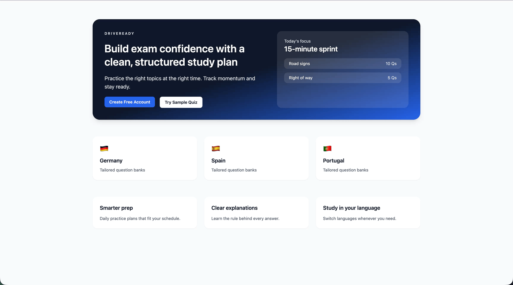

# AI-Powered Driving License Exam Prep Platform

[](https://github.com/MVCionOld/ai-dev-tools-zoomcamp-project/actions/workflows/ci.yml)



---

See [PROJECT.md](./PROJECT.md) for problem statement and features.

---

## AI-enablement

* Inital repo scaffolding was heavily aassisted by GitHub Copilot.
* Ideas, target architecture and implementation roadmap was rigirously planned using GitHub Copilot in `plan` mode (model Claude Opus 4.5).
* Agent created [OpenAPI](openapi.yaml) based on feature list.
* Frontend UI has been scaffolded using Loveable, for more details see [here](./frontend/outline/SETUP.md).
* Leveraging multiagent mode, [frontend](frontend/.instructions.md) and [backend](backend/.instructions.md) was developed in parallel using GitHub Copilot, i.e. GPT-5.2-Codex.
* Context7 was used to assist with up-to-date documentation and code snippets generation.
* ... and CI/CD workflows were created using GitHub Copilot as well.

---

## Quick Links

| Document | Purpose |
|----------|---------|
| [SETUP.md](./SETUP.md) | **Start here** — Prerequisites, install, run |
| [docs/MVP.md](./docs/MVP.md) | Sprint 1-2 scope, Definition of Done |
| [docs/api-contract.md](./docs/api-contract.md) | Full API request/response schemas |
| [ARCHITECTURE.md](./ARCHITECTURE.md) | System design, tech stack, layers |
| [CONTRIBUTING.md](./CONTRIBUTING.md) | Git workflow, PR process |

## Repository Structure

```
├── backend/           # Django + DRF API
├── frontend/          # React + TypeScript SPA
├── docs/              # API contract, MVP scope, UX scenarios
└── .github/           # Copilot instructions
```

## Development

```bash
# Backend
cd backend && uv sync && uv run python manage.py runserver

# Frontend  
cd frontend && npm install && npm run dev
```

See [SETUP.md](./SETUP.md) for complete instructions.
